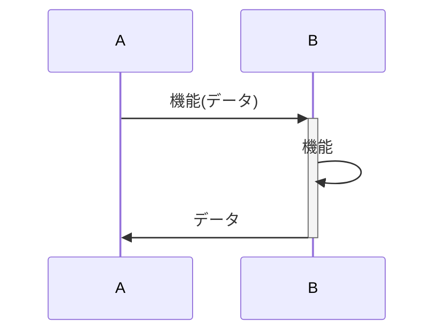

# システムシーケンス

## 概要

基本的に認証処理は省いています。

## シーケンス図

- [運営用 Web コンソール](admin.md)
- [参加者用アプリ](mobile.md)
- [共通](common.md)

## 前提

### 凡例

- 機能`feature`
- データ`(data)`

### データについて

- 画像 ID:string と画像データ:raw は異なる

[データの仕様](../spec/system/data.md)
