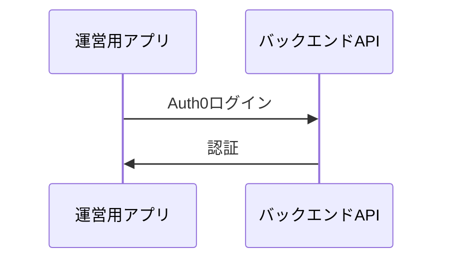
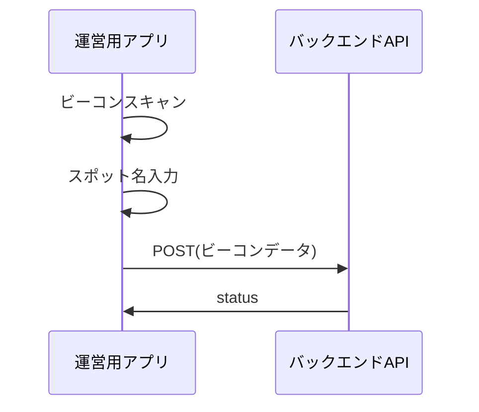
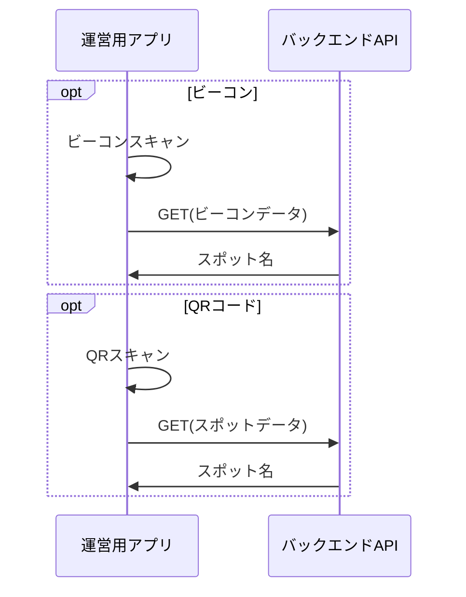
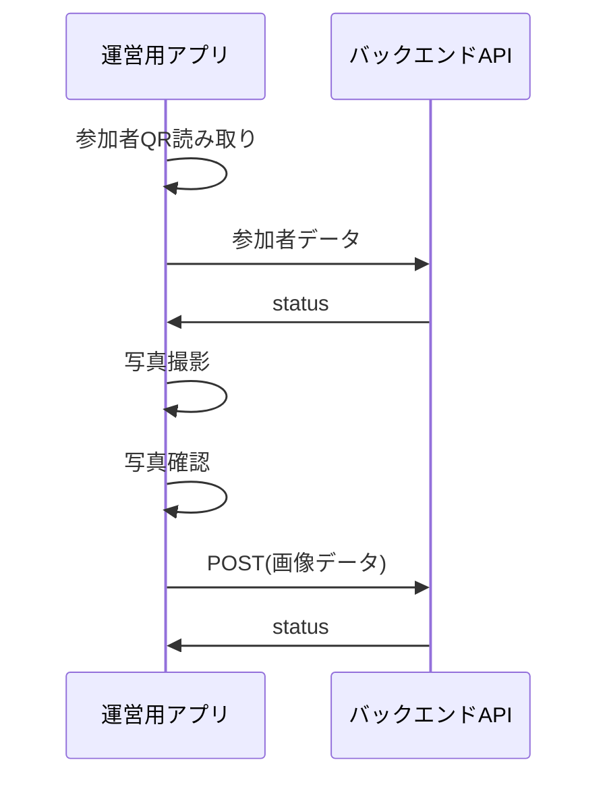

# イベント運営用アプリ

## 　シーケンス図

### ログイン

```mermaid
sequenceDiagram
    participant app as 運営用アプリ
    participant back as バックエンドAPI
    app ->> back: Auth0ログイン
    back ->> app: 認証
    
```

### スポット登録

```mermaid
sequenceDiagram
    participant app as 運営用アプリ
    participant back as バックエンドAPI
    app ->> app: ビーコンスキャン
    app ->> app: スポット名入力
    app ->> back: POST(ビーコンデータ)
    back ->> app: status
    
```

### スポット確認

```mermaid
sequenceDiagram
    participant app as 運営用アプリ
    participant back as バックエンドAPI
    opt ビーコン
    app ->> app: ビーコンスキャン
    app ->> back: GET(ビーコンデータ)
    back ->> app: スポット名
    end
    opt QRコード
    app ->> app: QRスキャン
    app ->> back: GET(スポットデータ)
    back ->> app: スポット名
    end
    
```

### 写真撮影

```mermaid
sequenceDiagram
    participant app as 運営用アプリ
    participant back as バックエンドAPI
    app ->> app: 参加者QR読み取り
    app ->> back: 参加者データ
    back ->> app: status
    app ->> app: 写真撮影
    app ->> app: 写真確認
    app ->> back: POST(画像データ)
    back ->> app: status
    
```
