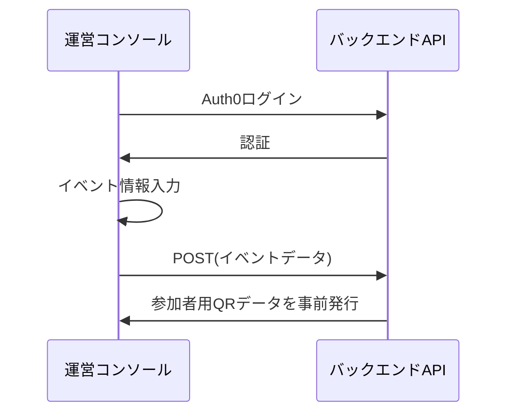
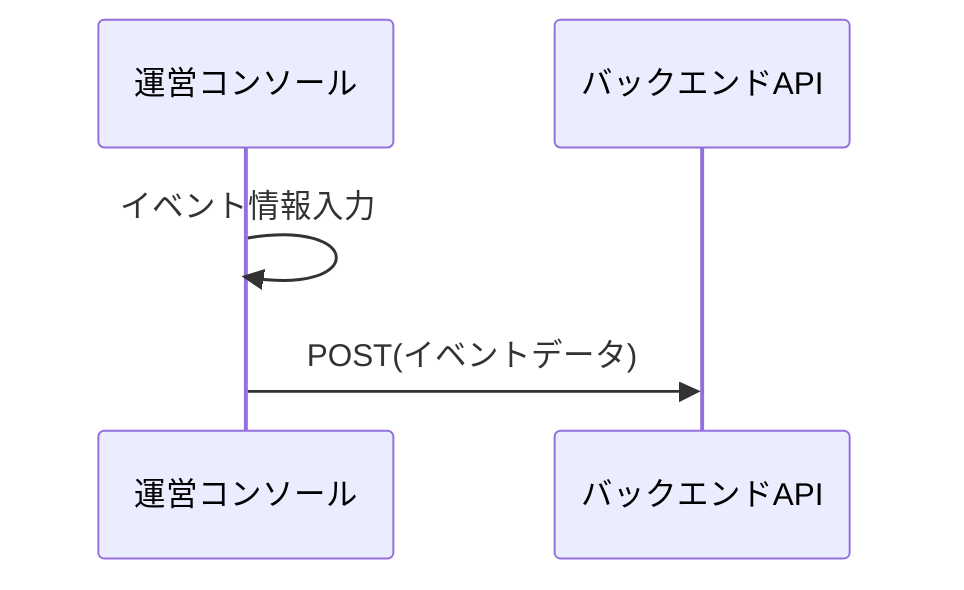
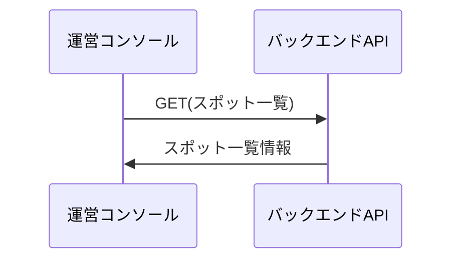
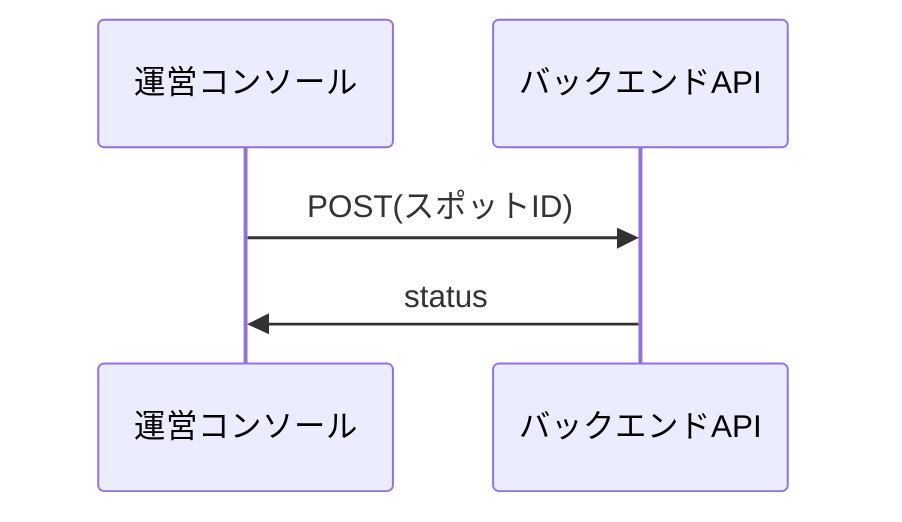
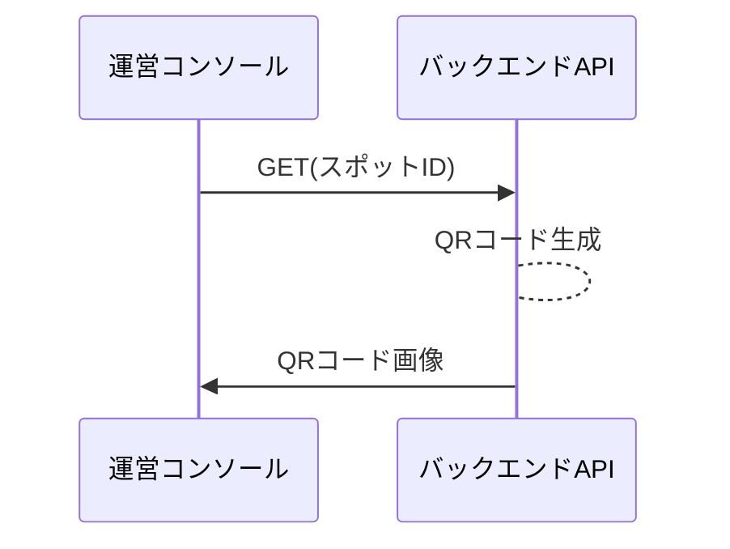
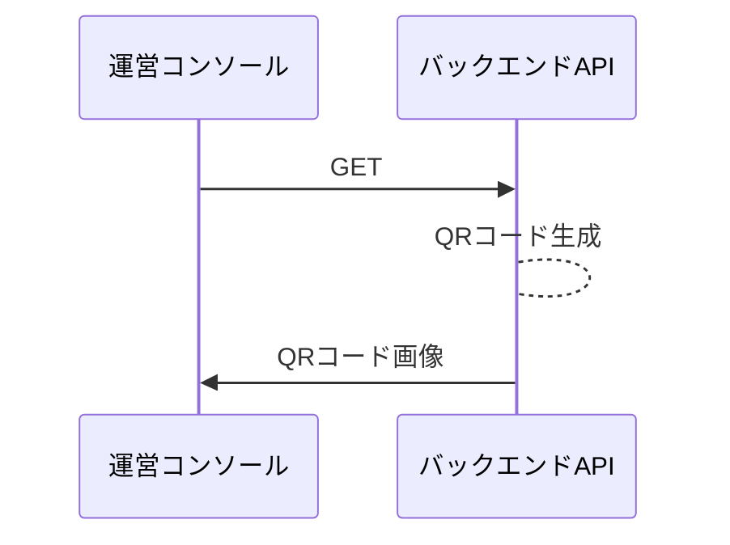
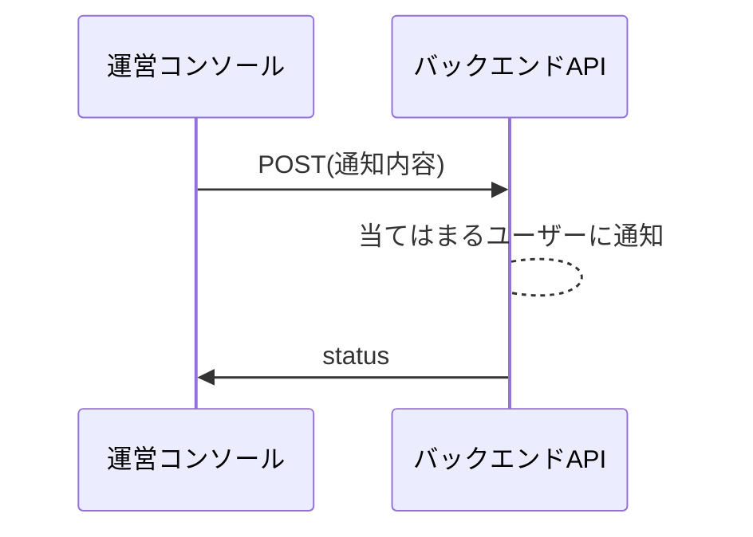
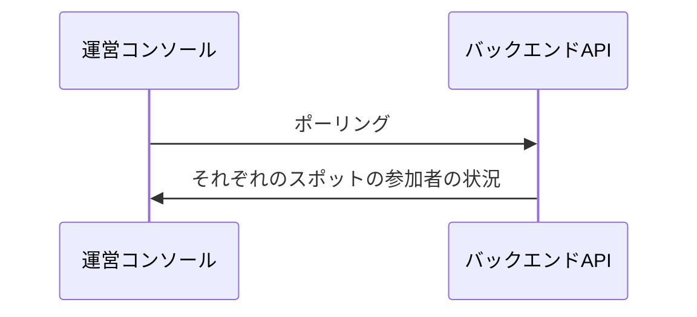
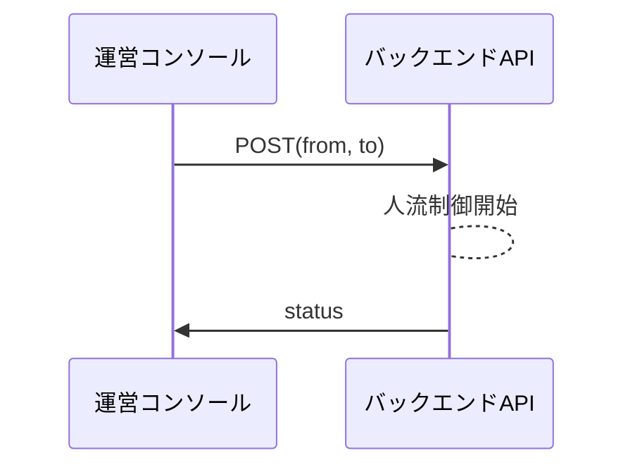

# イベント運営用コンソール シーケンス図

### イベント作成

```mermaid
sequenceDiagram
    participant web as 運営コンソール
    participant back as バックエンドAPI
    web ->> back: Auth0ログイン
    back ->> web: 認証
    web ->> web: イベント情報入力
    web ->> back: POST(イベントデータ)
    back ->> web: 参加者用QRデータを事前発行
    
```

### イベント更新

```mermaid
sequenceDiagram
    participant web as 運営コンソール
    participant back as バックエンドAPI
    web ->> web: イベント情報入力
    web ->> back: POST(イベントデータ)
    
```

### スポット一覧

```mermaid
sequenceDiagram
    participant web as 運営コンソール
    participant back as バックエンドAPI
    web ->> back: GET(スポット一覧)
    back ->> web: スポット一覧情報
    
```

### スポット削除

```mermaid
sequenceDiagram
    participant web as 運営コンソール
    participant back as バックエンドAPI
    web ->> back: POST(スポットID)
    back ->> web: status
    
```

### スポットQR発行

```mermaid
sequenceDiagram
    participant web as 運営コンソール
    participant back as バックエンドAPI
    web ->> back: GET(スポットID)
    back --> back: QRコード生成
    back ->> web: QRコード画像
    
```

### 参加用イベントQR発行

```mermaid
sequenceDiagram
    participant web as 運営コンソール
    participant back as バックエンドAPI
    web ->> back: GET
    back --> back: QRコード生成
    back ->> web: QRコード画像
    
```

### 手動通知

```mermaid
sequenceDiagram
    participant web as 運営コンソール
    participant back as バックエンドAPI
    web ->> back: POST(通知内容)
    back --> back: 当てはまるユーザーに通知
    back ->> web: status
    
```

### 人流監視

```mermaid
sequenceDiagram
    participant web as 運営コンソール
    participant back as バックエンドAPI
    web ->> back: ポーリング
    back ->> web: それぞれのスポットの参加者の状況
    
```

### 人流制御

```mermaid
sequenceDiagram
    participant web as 運営コンソール
    participant back as バックエンドAPI
    web ->> back: POST(from, to)
    back --> back: 人流制御開始
    back ->> web: status
    
```
