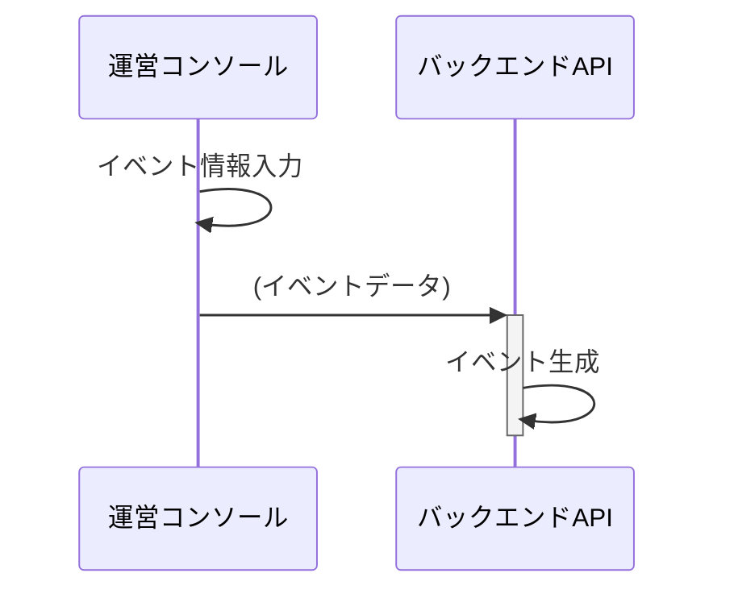
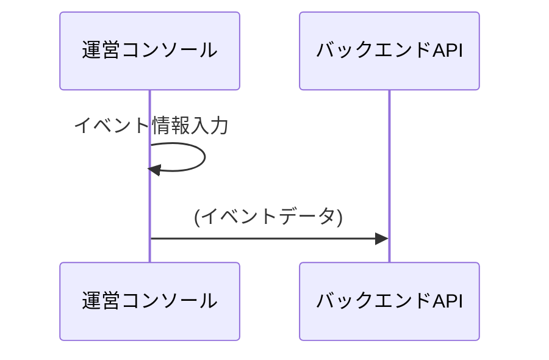
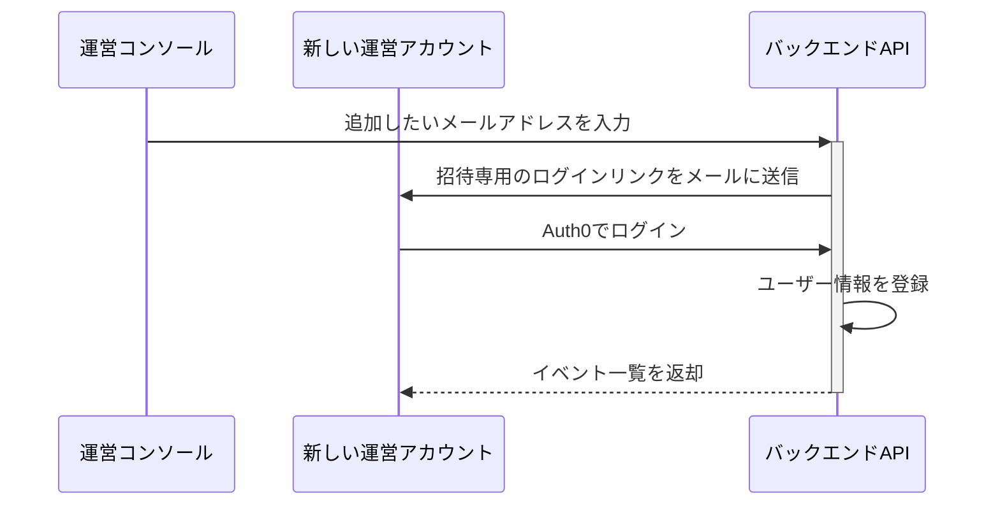
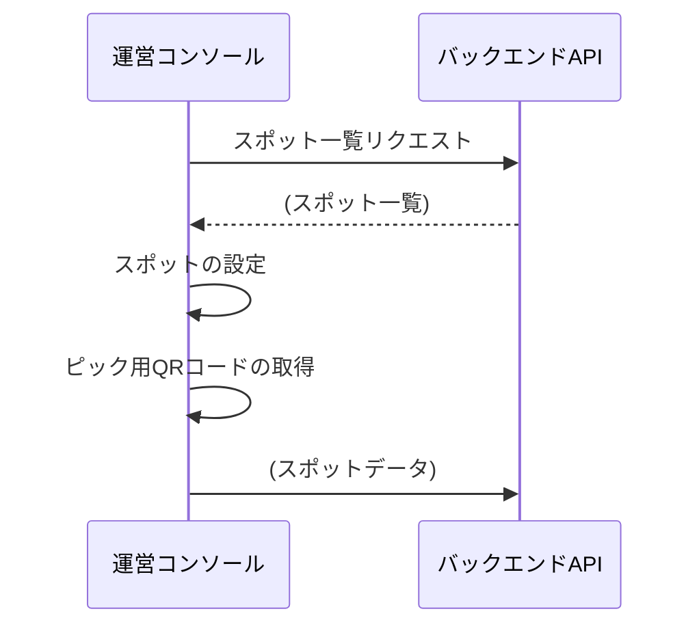
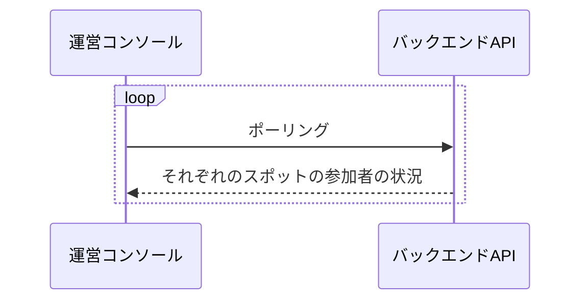
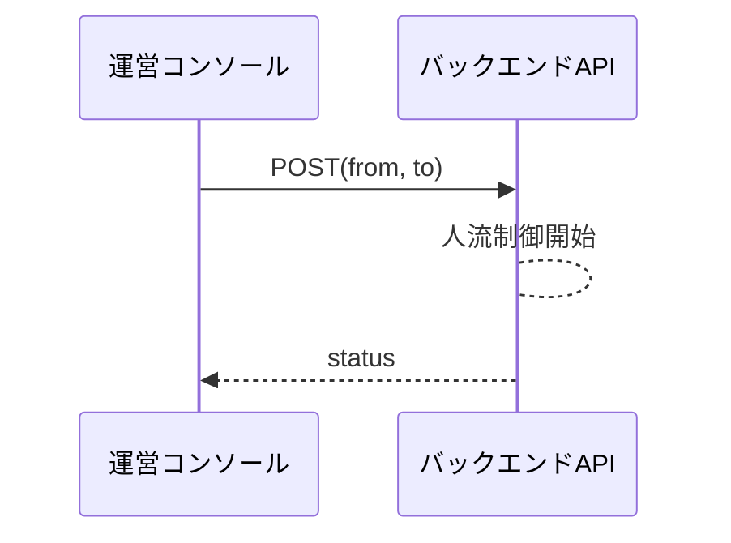

# イベント運営用コンソール

## 運営 Web 向けシーケンス図

### [イベント作成](../spec/overview/README.md#イベントの作成・設定)

- [イベントデータ](../spec/system/data.md#イベントデータ)
- [イベント参加 QR](../spec/system/data.md#LP/イベント参加兼用コード)

### [イベント更新](../spec/overview/README.md#イベントの作成・設定)

- [イベントデータ](../spec/system/data.md#イベントデータ)

### [運営アカウント追加](../spec/overview/README.md#イベント管理者の招待)

### [スポットの設定](../spec/overview/README.md#スポットの詳細設定)

スポット名の変更・ピックの切り替え・スポットの削除・QR の発行を行う

- [スポットデータ](../spec/system/data.md#スポット)
- [ピック用 QR コード](../spec/system/data.md#ピックスポットのパレット取得コード)

### [人流監視](../spec/overview/README.md#人流制御)

- [スポットの状況](../spec/system/data.md#スポットのイベントログ)

### [人流制御](../spec/overview/README.md#人流制御)

