# イベント運営用コンソール

## 運営Web向けシーケンス図

### イベント作成

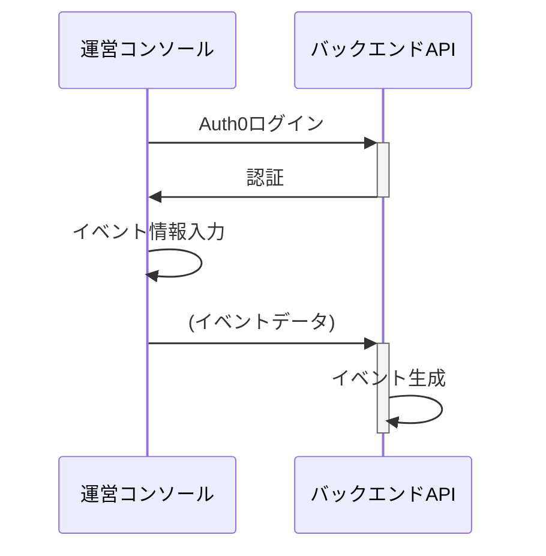

### イベント更新

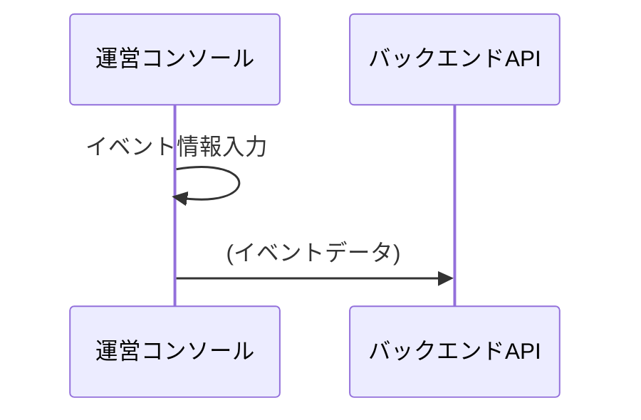

### 運営アカウント追加

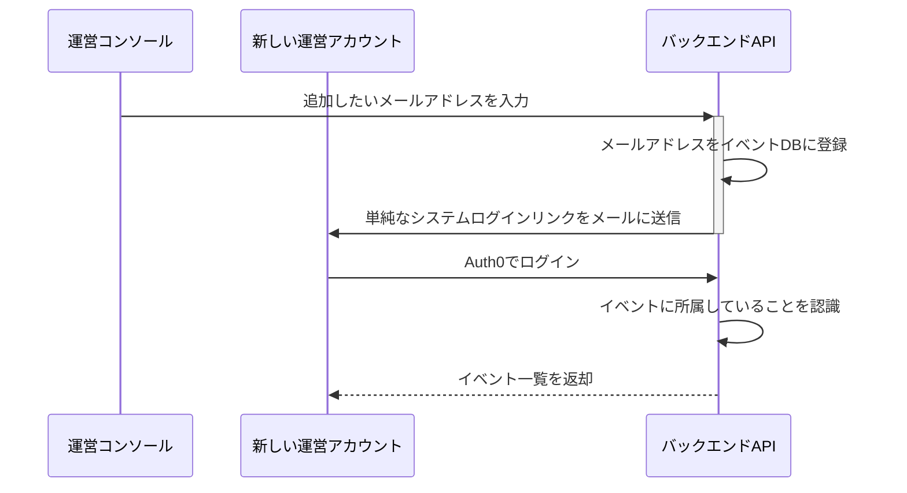

### スポット一覧

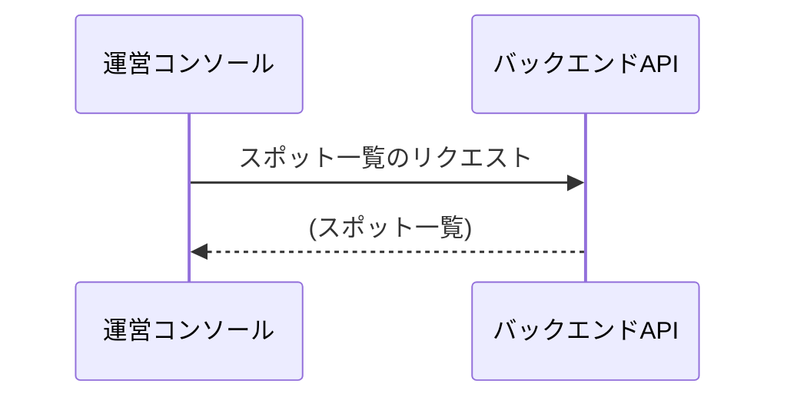

### スポット削除

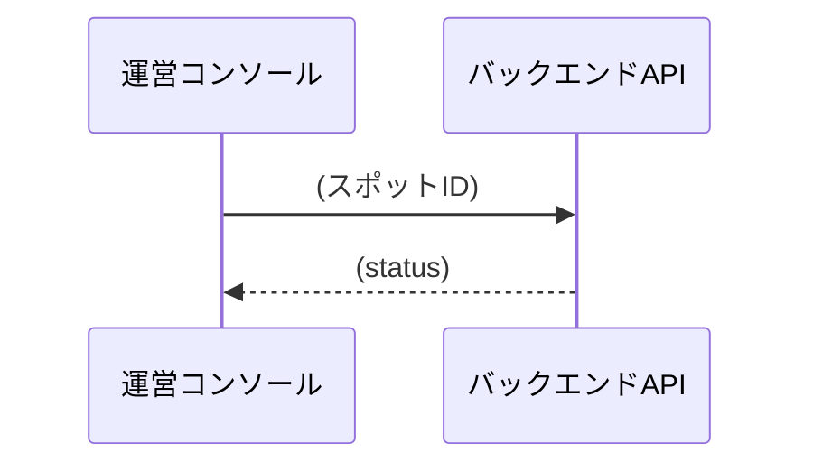

### スポットQR発行

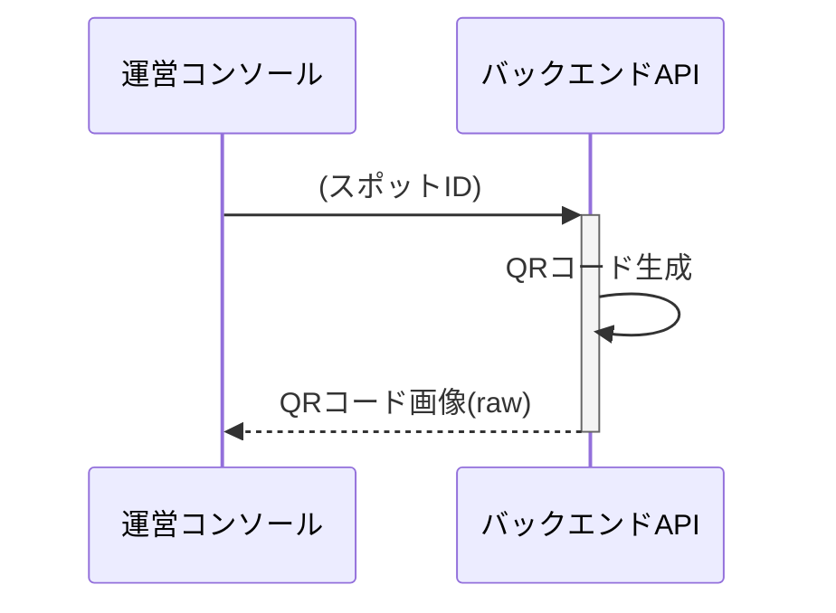

### 参加用イベントQR発行

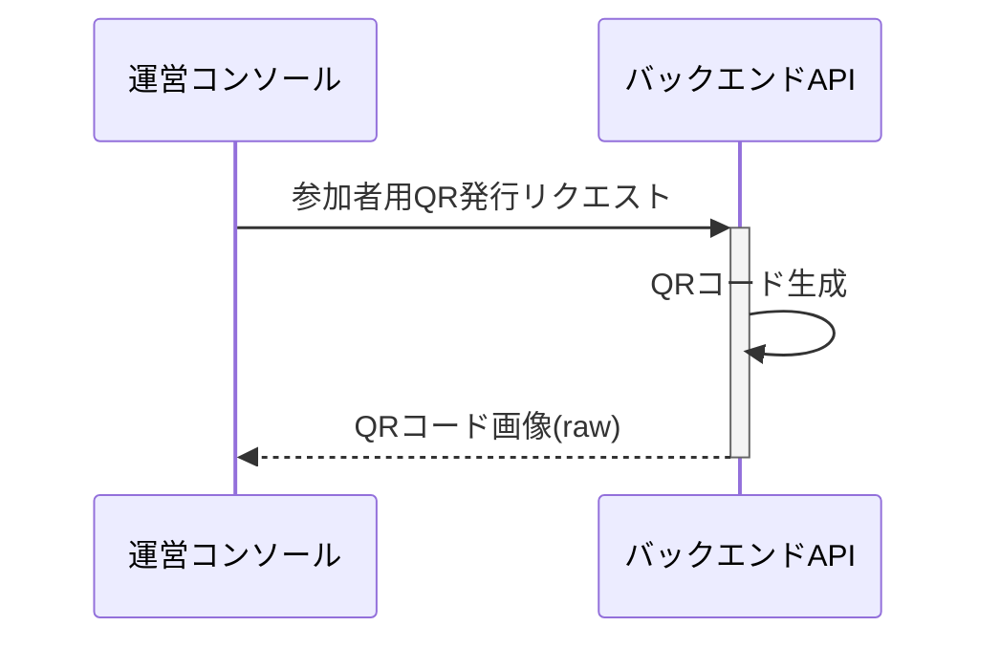

### 手動通知

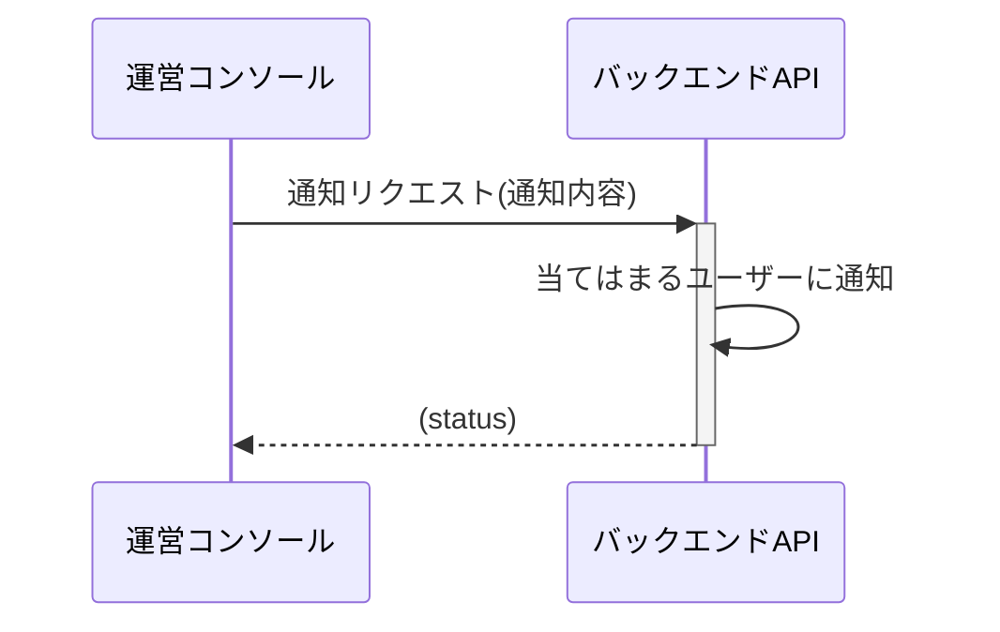

### 人流監視

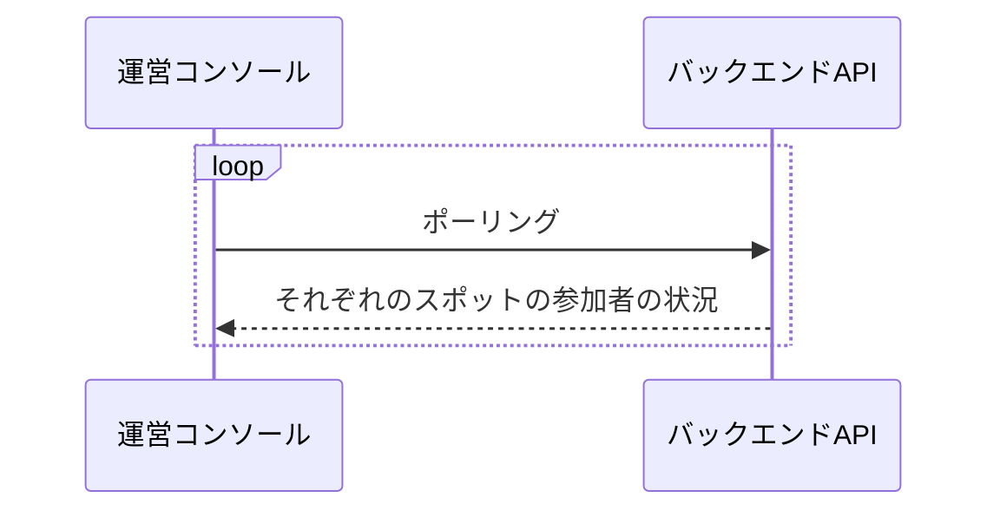

### 人流制御

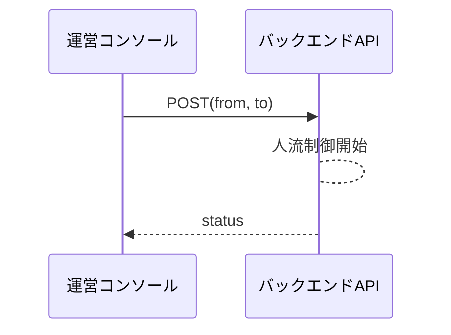

## 運営モバイル向けシーケンス図

### スポット登録

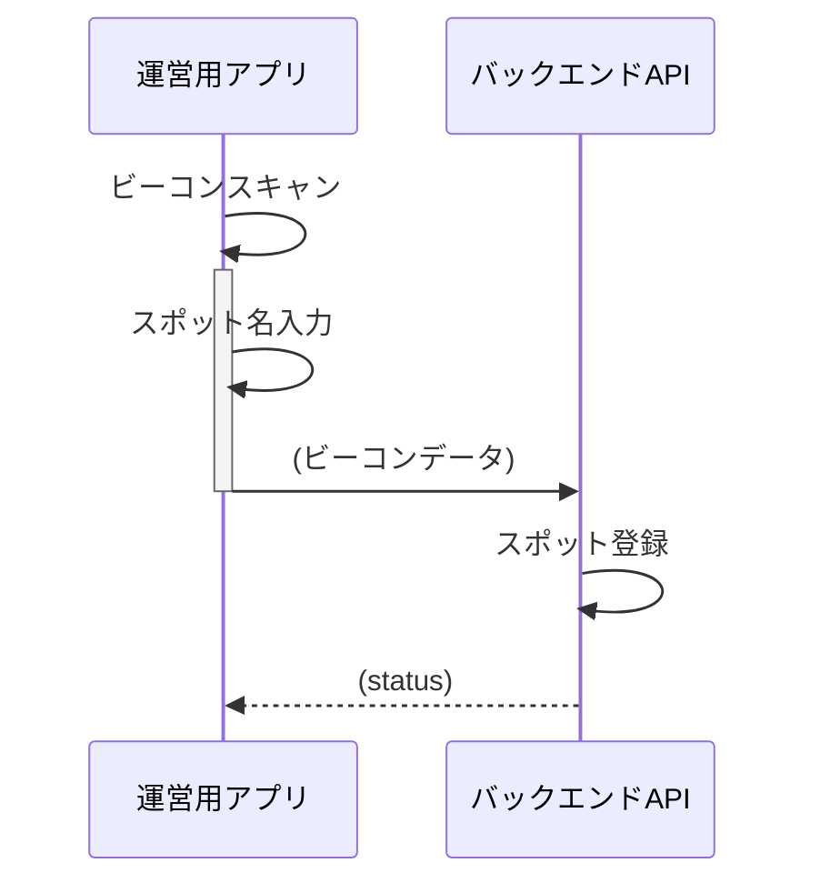

### スポット確認

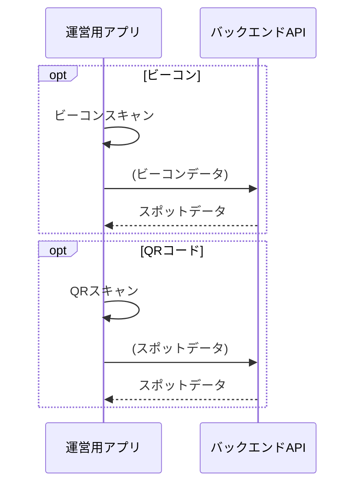

### 写真撮影

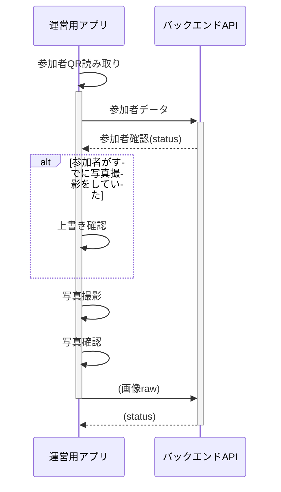
