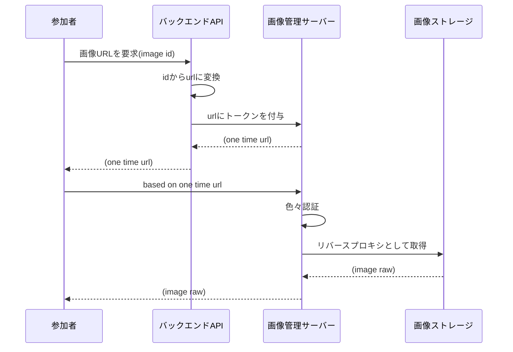
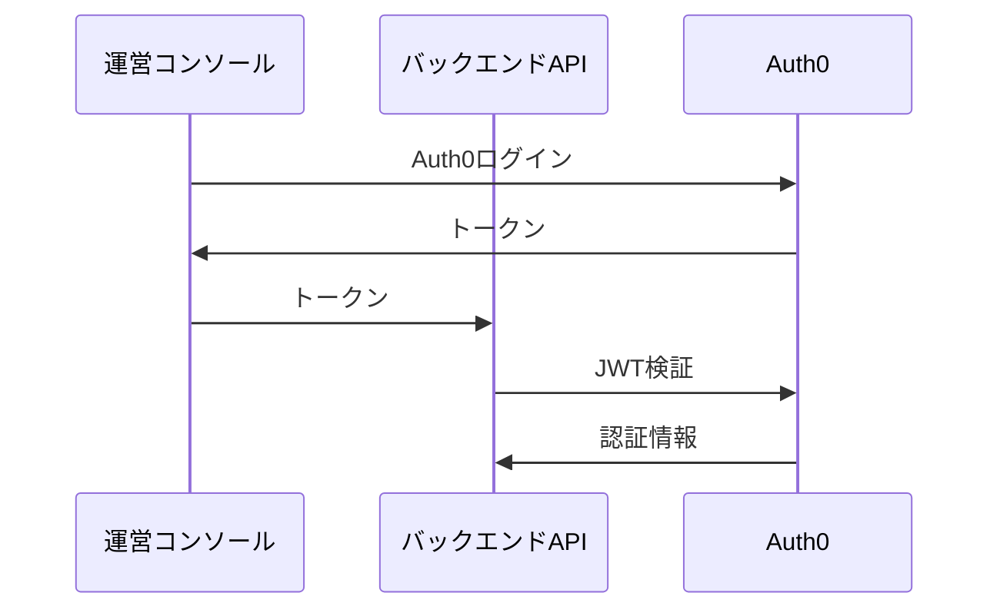
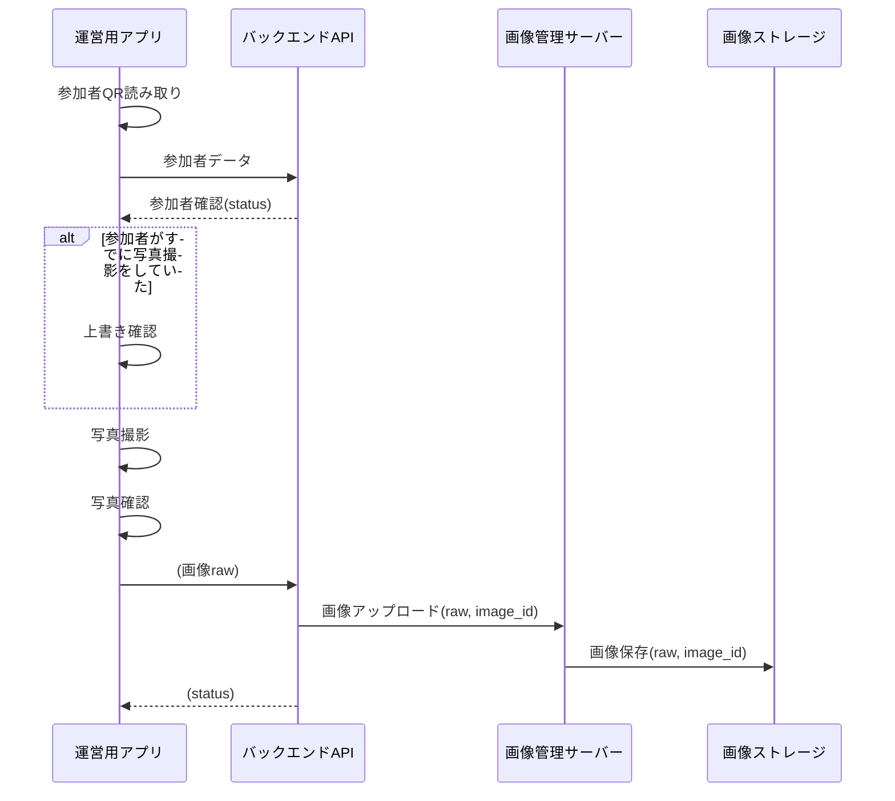
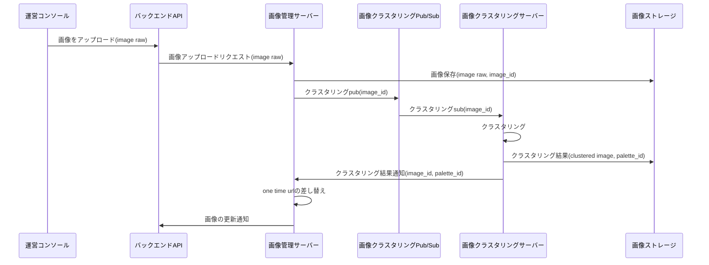
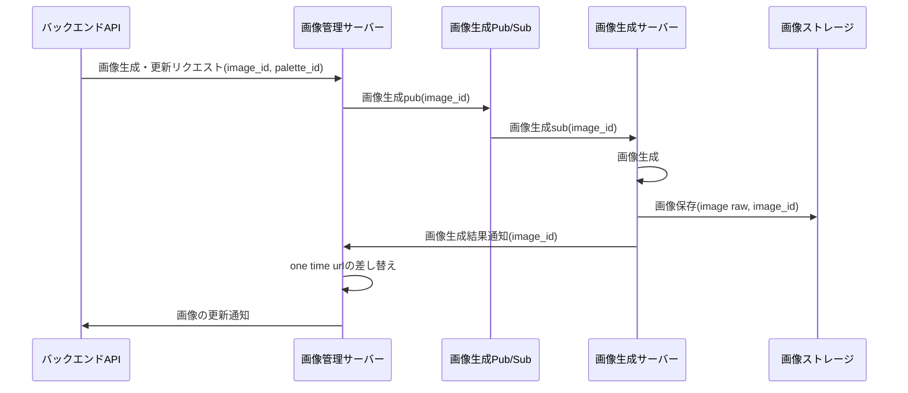
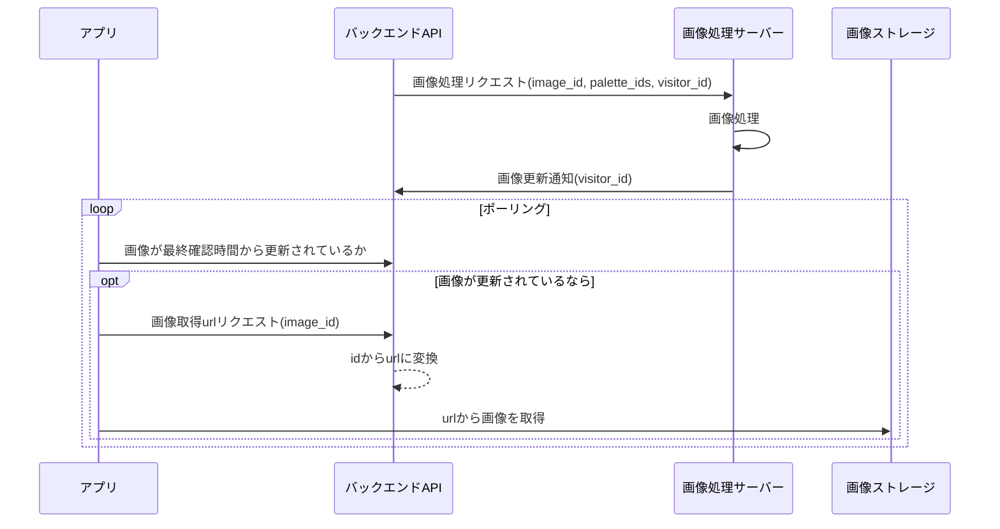

# 汎用シーケンス

## 参加者

### 画像取得

## 運営

### [運営ログイン](../spec/overview/README.md#Auth0-によるログイン)

### [写真撮影](../spec/overview/README.md#写真撮影)

### 画像アップロード

- [画像の更新通知](#画像更新)

### 画像生成

- [画像の更新通知](#画像更新)

### 画像更新

