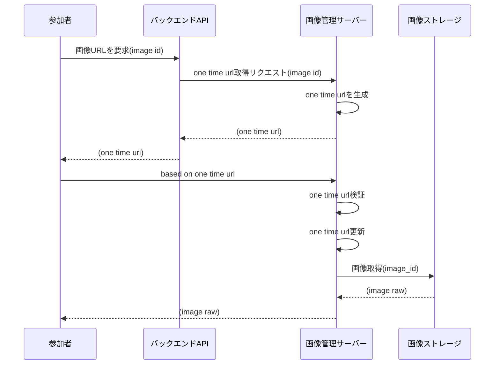
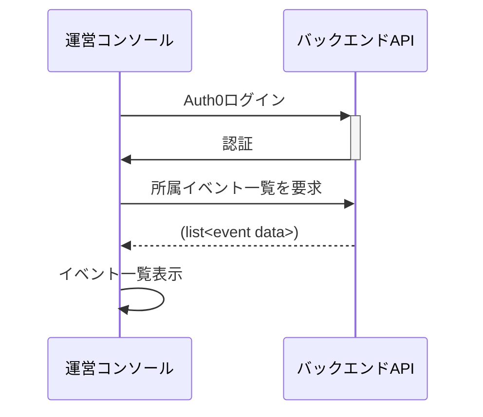
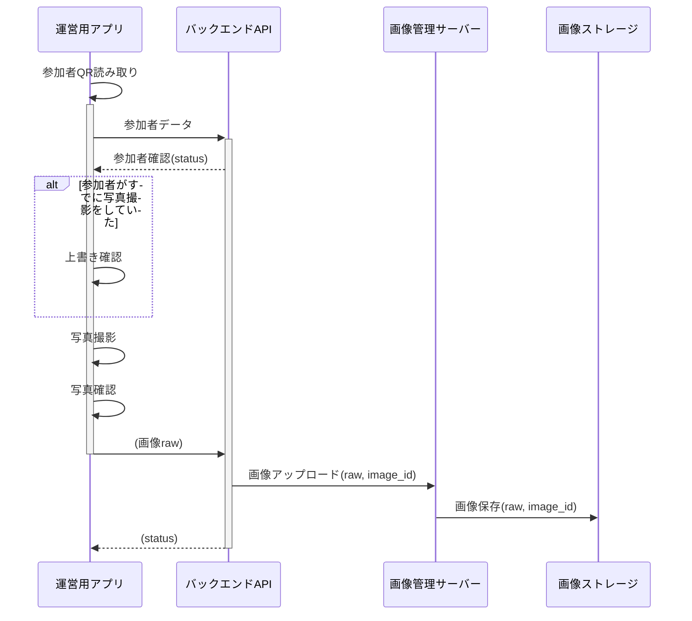
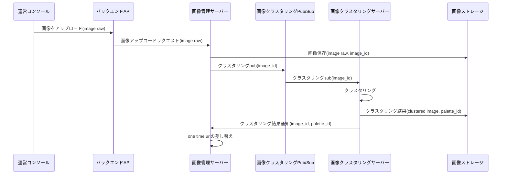
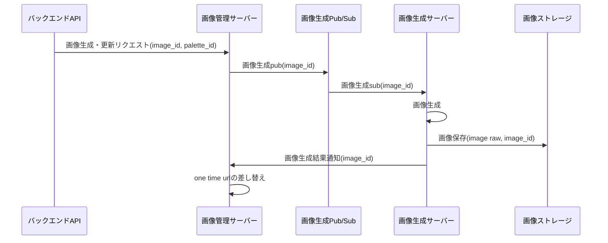

# 汎用シーケンス

## 参加者

### 画像取得

TODO: 以下は未改修

```mermaid
sequenceDiagram
    participant app as 参加者
    participant back as バックエンドAPI
    participant img as 画像管理サーバー
    participant storage as 画像ストレージ
    app ->> back: 画像URLを要求(image id)
    back ->> img: one time url取得リクエスト(image id)
    img ->> img: one time urlを生成
    img -->> back: (one time url)
    back -->> app: (one time url)
    app ->> img: based on one time url
    img ->> img: one time url検証
    img ->> img: one time url更新
    img ->> storage: 画像取得(image_id)
    storage -->> img: (image raw)
    img -->> app: (image raw)

```

## 運営

### [運営ログイン](../spec/overview/README.md#Auth0-によるログイン)

```mermaid
sequenceDiagram
    participant web as 運営コンソール
    participant back as バックエンドAPI
    web ->>+ back: Auth0ログイン
    back ->>- web: 認証
    web ->> back: 所属イベント一覧を要求
    back -->> web: (list<event data>)
    web ->> web: イベント一覧表示

```

### [写真撮影](../spec/overview/README.md#写真撮影)

```mermaid
sequenceDiagram
    participant app as 運営用アプリ
    participant back as バックエンドAPI
    participant img as 画像管理サーバー
    participant storage as 画像ストレージ
    app ->>+ app: 参加者QR読み取り
    app ->>+ back: 参加者データ
    back -->> app: 参加者確認(status)
    alt 参加者がすでに写真撮影をしていた
        app ->> app: 上書き確認
    end
    app ->> app: 写真撮影
    app ->> app: 写真確認
    app ->>- back: (画像raw)
    back ->> img: 画像アップロード(raw, image_id)
    img ->> storage: 画像保存(raw, image_id)
    back -->>- app: (status)

```

### 画像アップロード

```mermaid
sequenceDiagram
    participant admin as 運営コンソール
    participant back as バックエンドAPI
    participant img as 画像管理サーバー
    participant pubsub as 画像クラスタリングPub/Sub
    participant cluster as 画像クラスタリングサーバー
    participant storage as 画像ストレージ
    admin ->> back: 画像をアップロード(image raw)
    back ->> img: 画像アップロードリクエスト(image raw)
    img ->> storage: 画像保存(image raw, image_id)
    img ->> pubsub: クラスタリングpub(image_id)
    pubsub ->> cluster: クラスタリングsub(image_id)
    cluster ->> cluster: クラスタリング
    cluster ->> storage: クラスタリング結果(clustered image, palette_id)
    cluster ->> img: クラスタリング結果通知(image_id, palette_id)
    img ->> img: one time urlの差し替え

```

### 画像生成

```mermaid
sequenceDiagram
    participant back as バックエンドAPI
    participant img as 画像管理サーバー
    participant pubsub as 画像生成Pub/Sub
    participant gen as 画像生成サーバー
    participant storage as 画像ストレージ
    back ->> img: 画像生成・更新リクエスト(image_id, palette_id)
    img ->> pubsub: 画像生成pub(image_id)
    pubsub ->> gen: 画像生成sub(image_id)
    gen ->> gen: 画像生成
    gen ->> storage: 画像保存(image raw, image_id)
    gen ->> img: 画像生成結果通知(image_id)
    img ->> img: one time urlの差し替え

```
