# イベント参加者アプリ

## シーケンス図(共通)

### func: 画像取得処理

[運営用 Web コンソールのシーケンス図を参照](common.md#画像取得処理)

## イベント参加者のシーケンス

### [イベント参加時](../spec/overview/README.md#イベント参加-QR-Sスキャン)

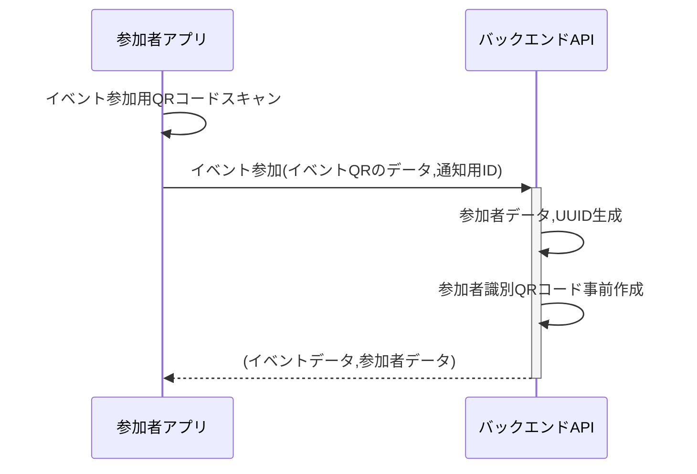

- QR コード
  - [LP/イベント参加兼用コード](../spec/system/data.md#lpイベント参加兼用コード)
  - [参加者識別コード](../spec/system/data.md#参加者識別コード)
- [イベントデータ](../spec/system/data.md#イベントデータ)
- [参加者データ](../spec/system/data.md#参加者アカウントのデータ)

### [アプリ起動時(イベント参加以降)](../spec/overview/README.md#アプリ起動時の更新)

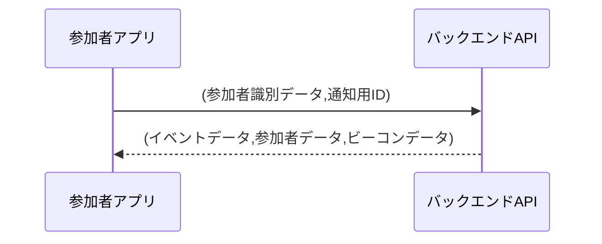

- [参加者識別データ(コードの JSON を流用)](../spec/system/data.md#参加者識別コード)
- [イベントデータ](../spec/system/data.md#イベントデータ)
- [参加者データ](../spec/system/data.md#参加者アカウントのデータ)
- [ビーコンデータ](../spec/system/data.md#ビーコン)

### [スポット検知](../spec/overview/README.md#スポット検知)

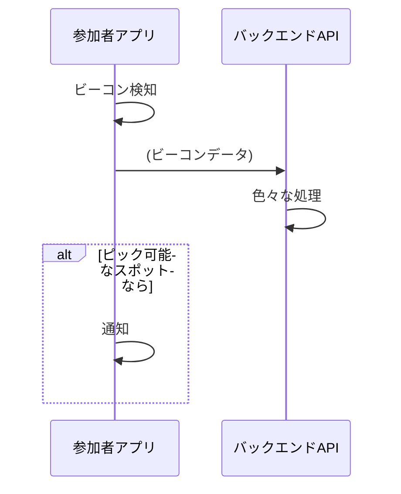

- [ビーコンデータ](../spec/system/data.md#ビーコン)

### [ピック用 QR コードスキャン](../spec/overview/README.md#ピック用-QR-スキャン)

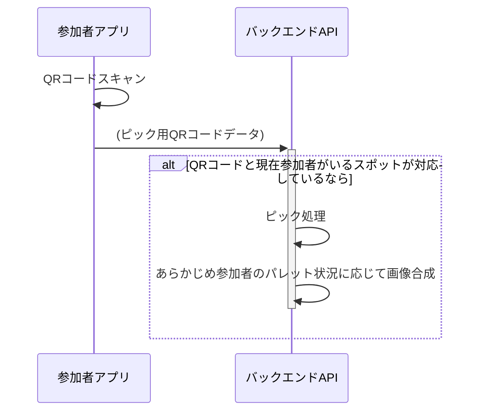

- [ピックスポットのパレット取得コード](../spec/system/data.md#ピックスポットのパレット取得コード)

### 画像選択

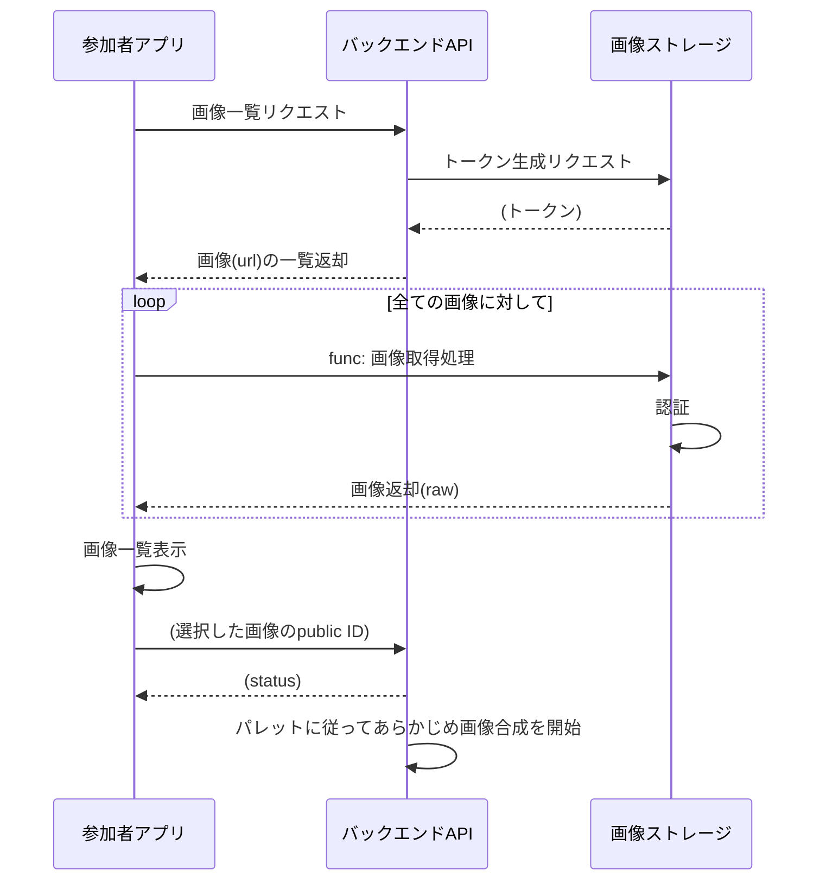

### [画像表示](../spec/overview/README.md#画像を表示)

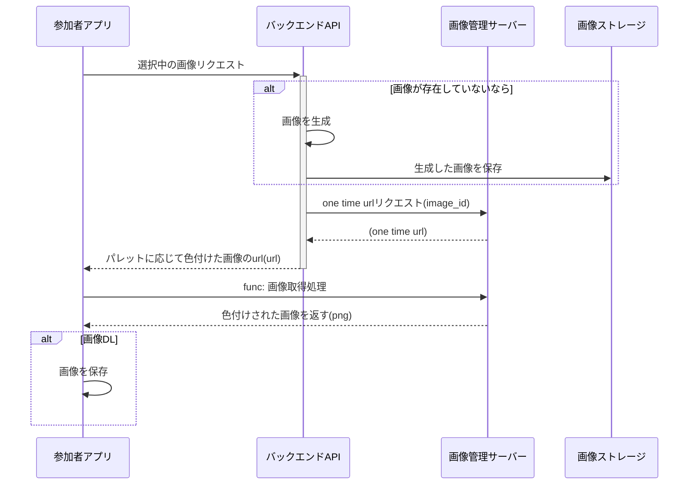

### 画像一覧取得

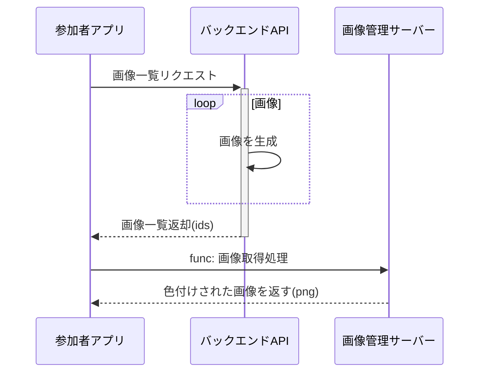

### [参加者用 QR コード表示](../spec/overview/README.md#参加者-QR-表示)

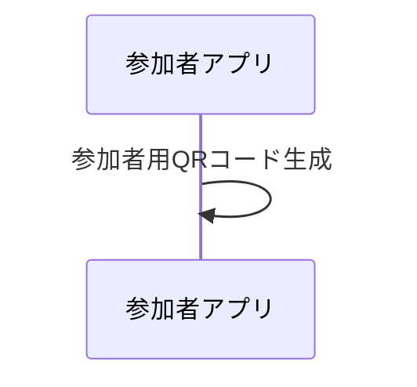

- [参加者用 QR コード](../spec/system/data.md#参加者識別コード)

### [通知の受信](../spec/overview/README.md#通知)

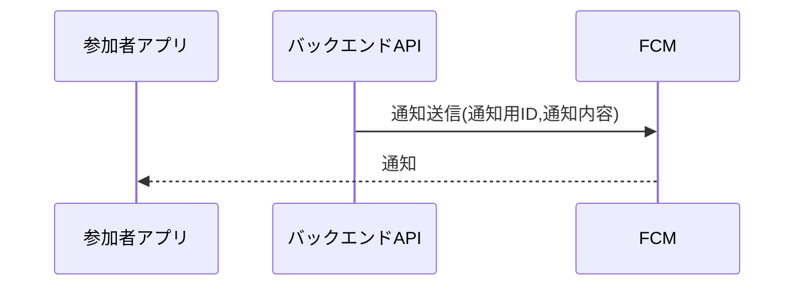

### [参加者データ削除](../spec/overview/README.md#アカウントの削除)

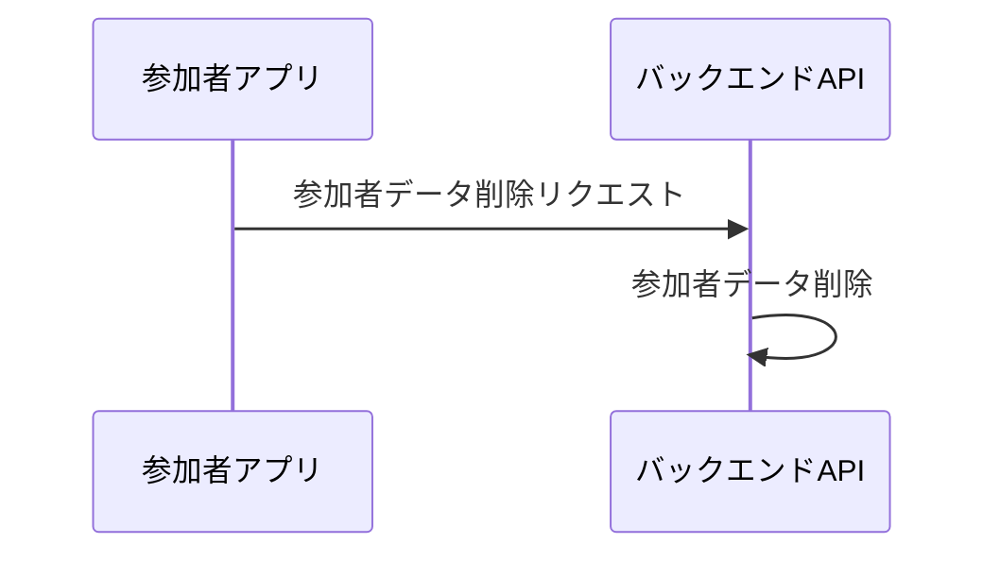

## イベント運営のシーケンス

[モバイル・コンソール共通の運営シーケンス](common.md#運営)

### [ビーコン・スポットの登録](../spec/overview/README.md#ビーコン・スポットの登録)

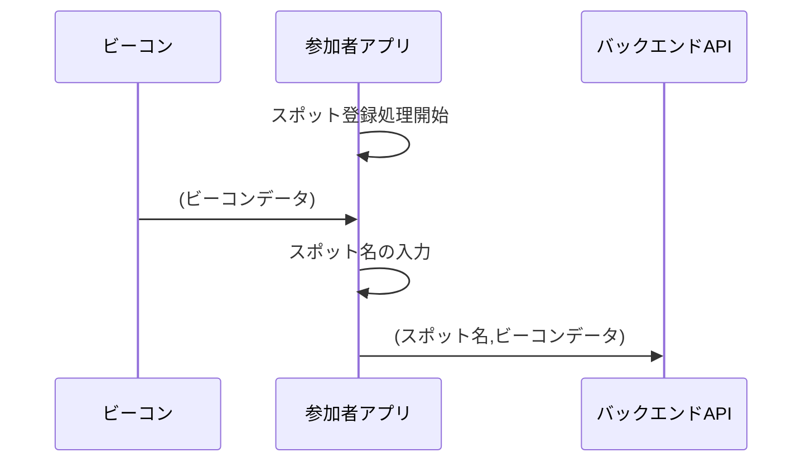

- [ビーコンデータ](../spec/system/data.md#ビーコン)

### [スポットの確認](../spec/overview/README.md#スポットの確認)

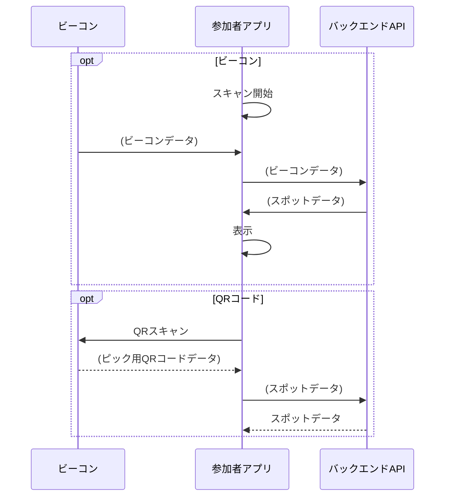

- [ビーコンデータ](../spec/system/data.md#ビーコン)
- [スポットデータ](../spec/system/data.md#スポット)
- [ピック用 QR コードデータ](../spec/system/data.md#ピックスポットのパレット取得コード)
