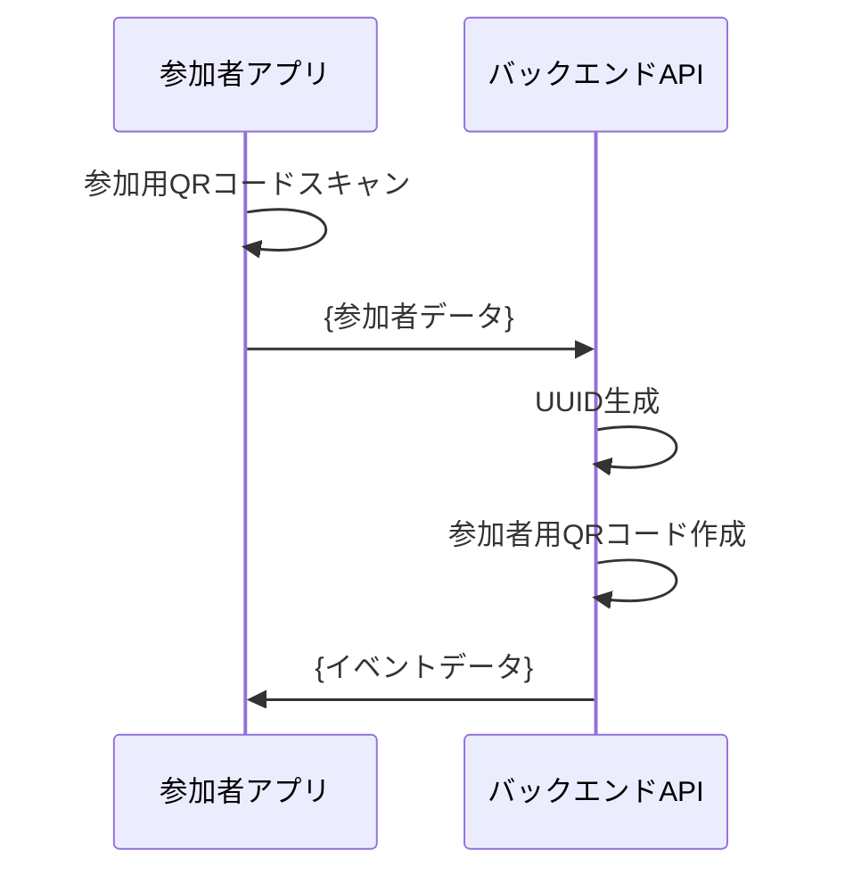
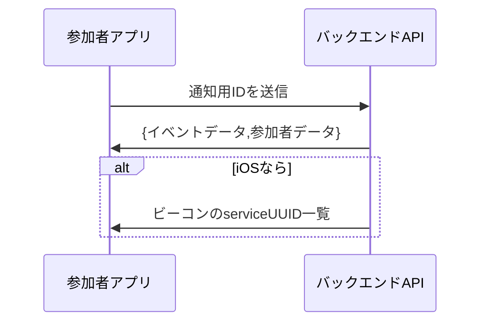
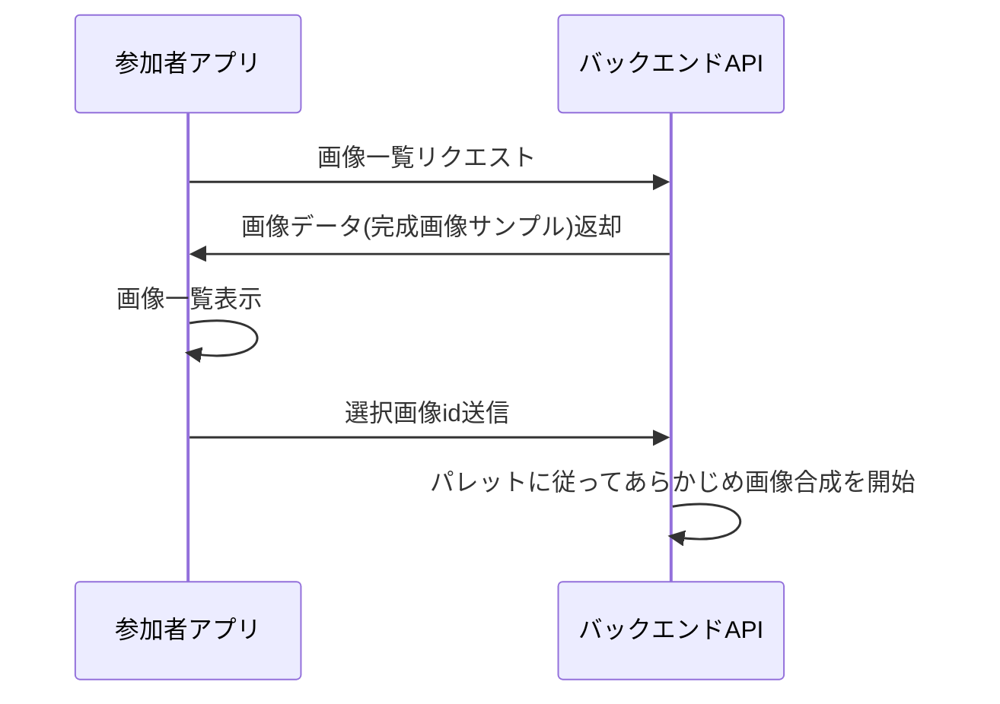
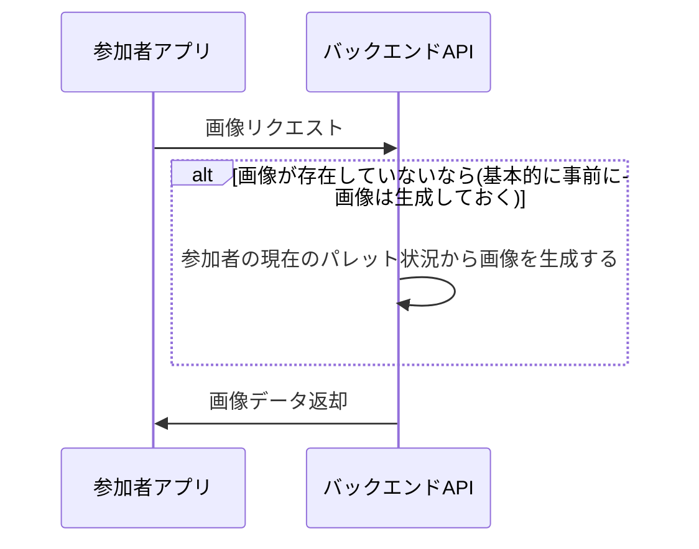
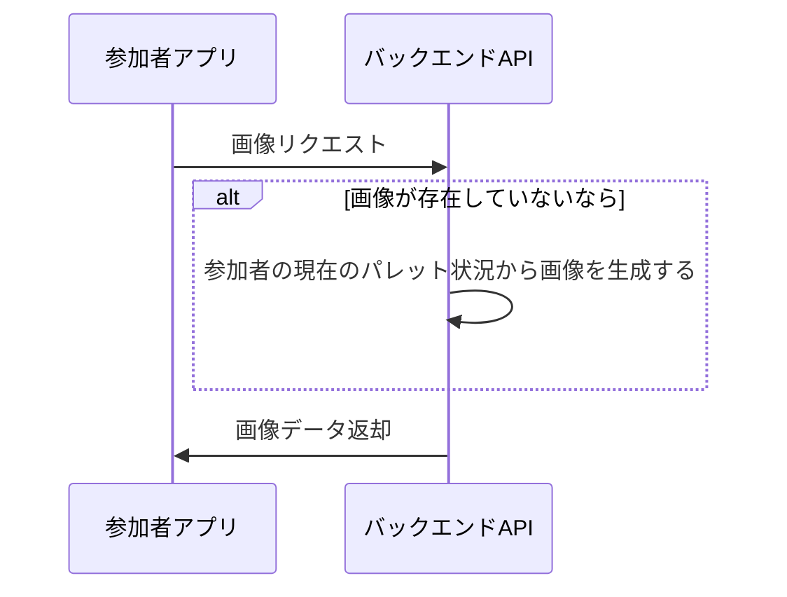
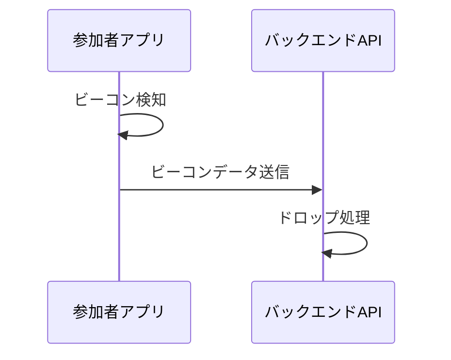
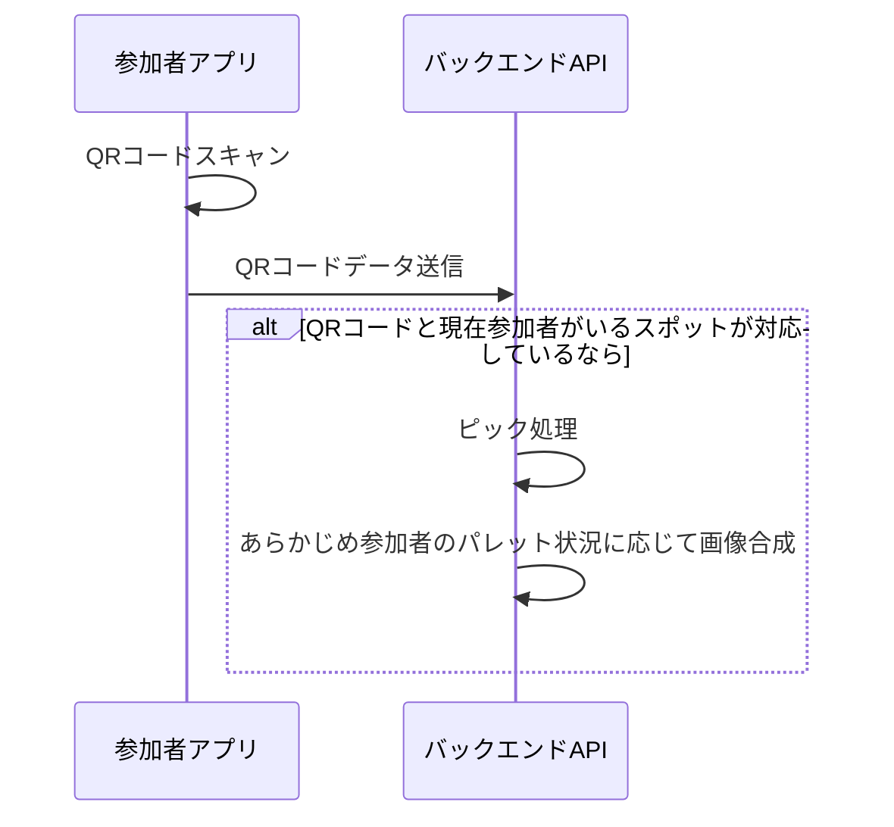
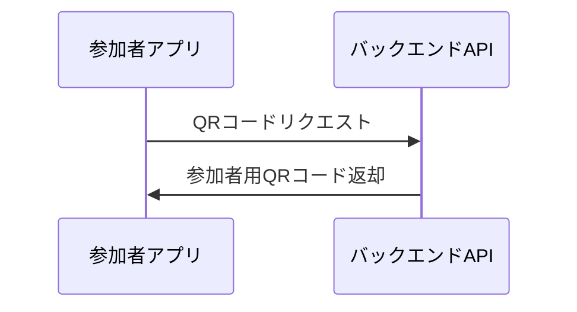
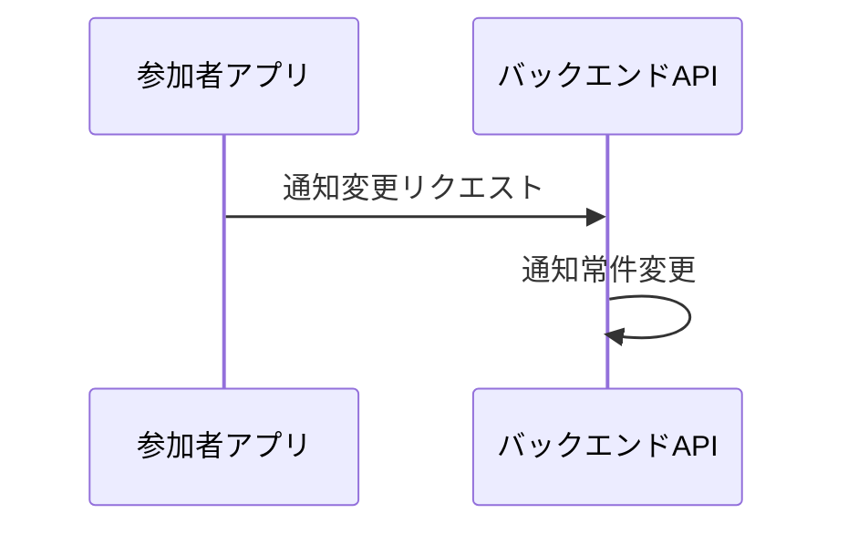
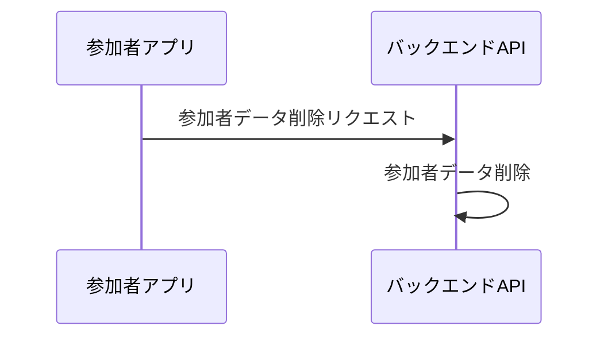

# イベント運営用コンソール

##  シーケンス図

### イベント参加時

```mermaid
sequenceDiagram
    participant app as 参加者アプリ
    participant back as バックエンドAPI
    app ->> app: 参加用QRコードスキャン
    app ->> back: {参加者データ}
    back ->> back: UUID生成
    back ->> back: 参加者用QRコード作成
    back ->> app: {イベントデータ}
    
```

### アプリ起動時(イベント参加以降)

```mermaid
sequenceDiagram
    participant app as 参加者アプリ
    participant back as バックエンドAPI
    app ->> back: 通知用IDを送信
    back ->> app: {イベントデータ,参加者データ}
    alt iOSなら
        back ->> app: ビーコンのserviceUUID一覧
    end
    
```

### 画像選択

```mermaid
sequenceDiagram
    participant app as 参加者アプリ
    participant back as バックエンドAPI
    app ->> back: 画像一覧リクエスト
    back ->> app: 画像データ(完成画像サンプル)返却
    app ->> app: 画像一覧表示
    app ->> back: 選択画像id送信
    back ->> back: パレットに従ってあらかじめ画像合成を開始

```

### 画像表示

```mermaid
sequenceDiagram
    participant app as 参加者アプリ
    participant back as バックエンドAPI
    app ->> back: 画像リクエスト
    alt 画像が存在していないなら(基本的に事前に画像は生成しておく)
      back ->> back: 参加者の現在のパレット状況から画像を生成する
    end
    back ->> app: 画像データ返却
```

### 画像DL

```mermaid
sequenceDiagram
    participant app as 参加者アプリ
    participant back as バックエンドAPI
    app ->> back: 画像リクエスト
    alt 画像が存在していないなら
      back ->> back: 参加者の現在のパレット状況から画像を生成する
    end
    back ->> app: 画像データ返却
```

### スポット検知

```mermaid
sequenceDiagram
    participant app as 参加者アプリ
    participant back as バックエンドAPI
    app ->> app: ビーコン検知
    app ->> back: ビーコンデータ送信
    back ->> back: ドロップ処理
```

### ピック用QRコードスキャン

```mermaid
sequenceDiagram
    participant app as 参加者アプリ
    participant back as バックエンドAPI
    app ->> app: QRコードスキャン
    app ->> back: QRコードデータ送信
    alt QRコードと現在参加者がいるスポットが対応しているなら
      back ->> back: ピック処理
      back ->> back: あらかじめ参加者のパレット状況に応じて画像合成
    end
```

### 参加者用QRコード表示

```mermaid
sequenceDiagram
    participant app as 参加者アプリ
    participant back as バックエンドAPI
    app ->> back: QRコードリクエスト
    back ->> app: 参加者用QRコード返却
```

### 通知のON/OFF

```mermaid
sequenceDiagram
    participant app as 参加者アプリ
    participant back as バックエンドAPI
    app ->> back: 通知変更リクエスト
    back ->> back: 通知常件変更
```

### 参加者データ削除

```mermaid
sequenceDiagram
    participant app as 参加者アプリ
    participant back as バックエンドAPI
    app ->> back: 参加者データ削除リクエスト
    back ->> back: 参加者データ削除
```
