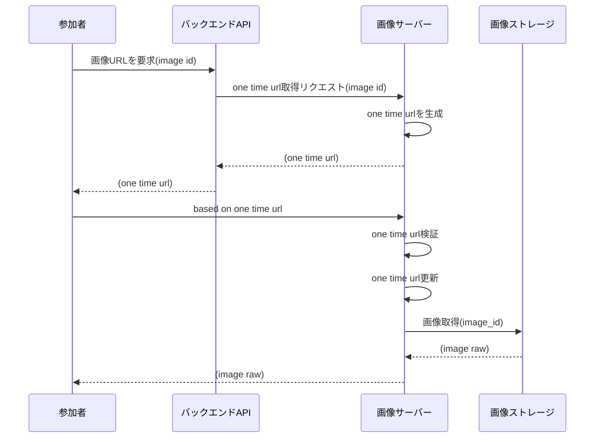
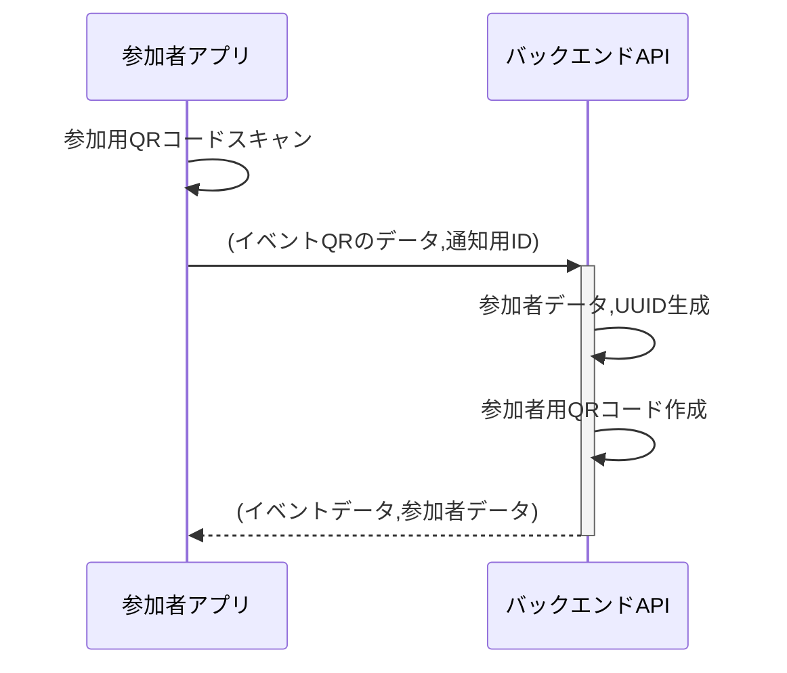
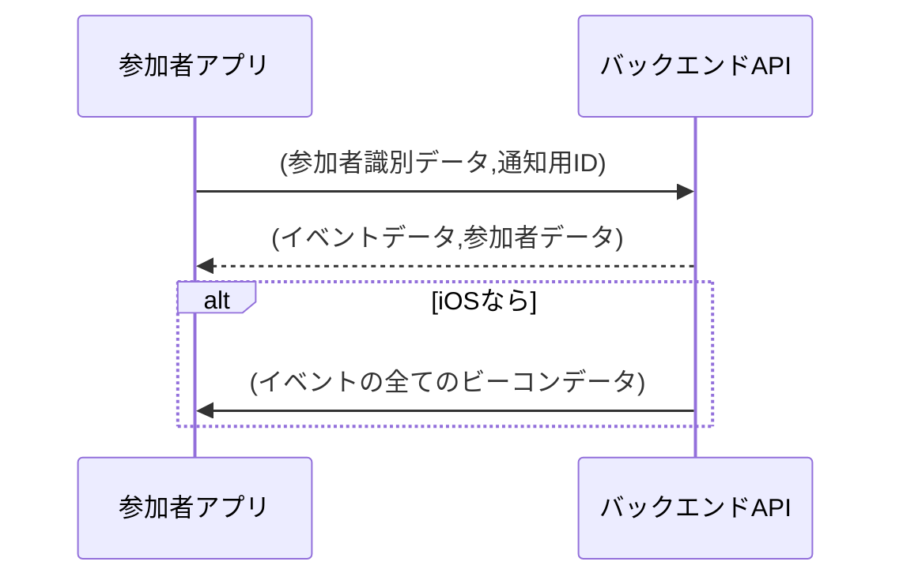
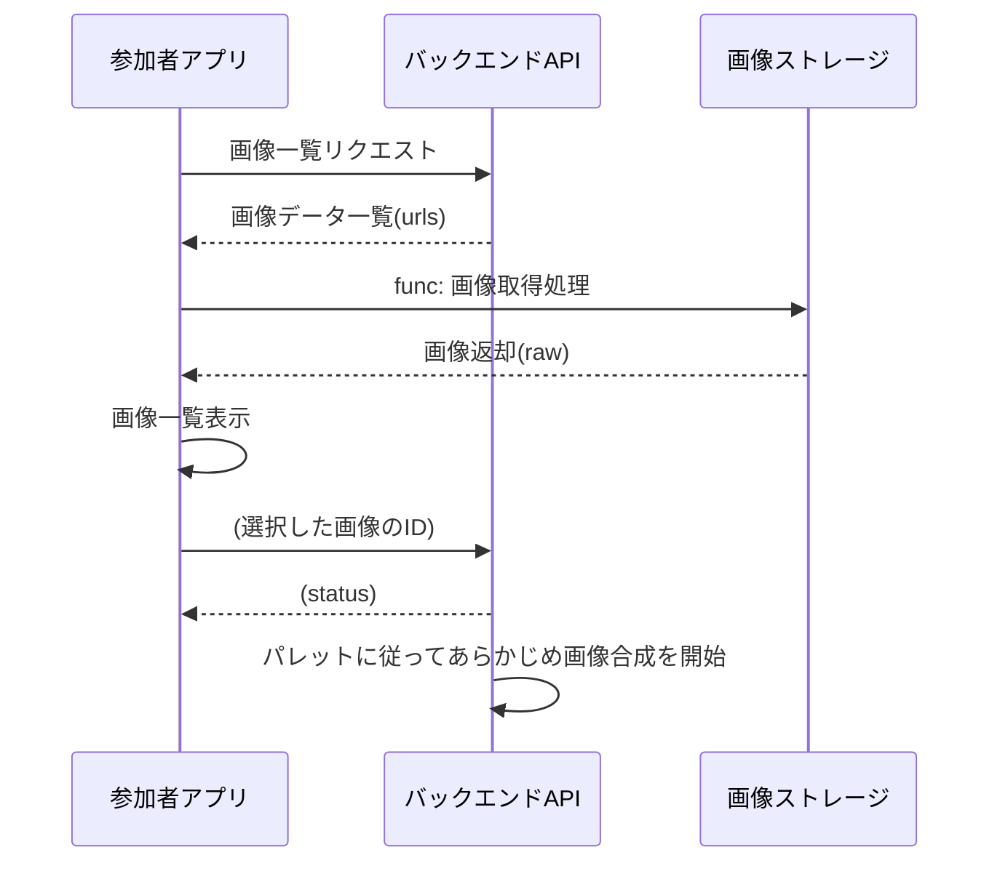
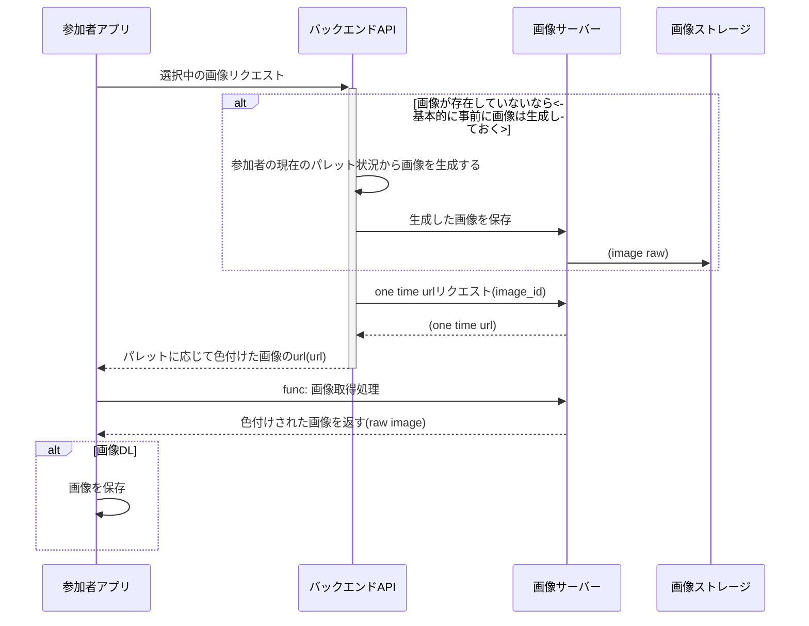
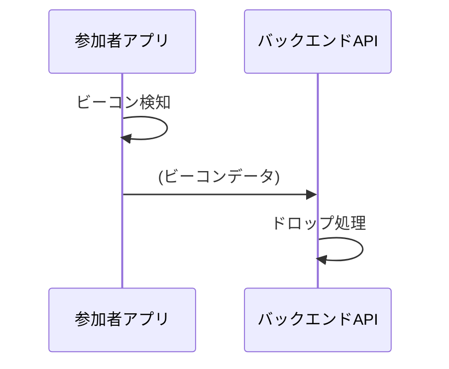
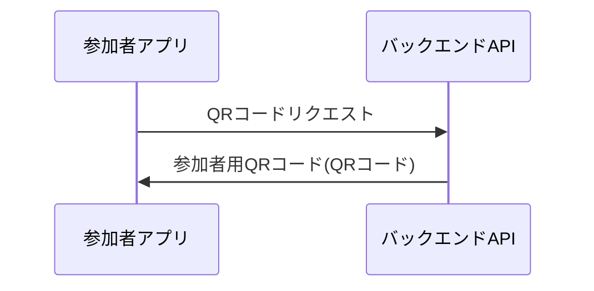

# イベント参加者アプリ

## シーケンス図(共通)

### func: 画像取得処理

## シーケンス図(ケース)

### イベント参加時

### アプリ起動時(イベント参加以降)

### 画像選択

### 画像表示

### スポット検知

### ピック用QRコードスキャン

### 参加者用QRコード表示

### 通知のON/OFF

### 参加者データ削除

