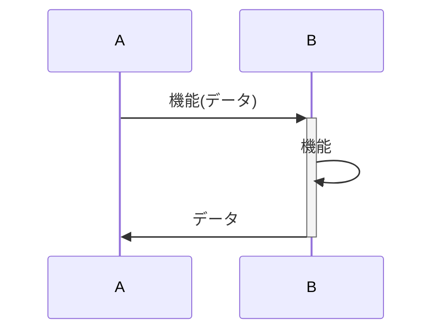

# システムシーケンス

## 概要

基本的に認証処理は省いています。

## シーケンス図

- [運営用Webコンソール](admin.md)
- [参加者用アプリ](mobile.md)

## 前提

### 凡例

- 機能`feature`
- データ`(data)`

### データについて

- 画像ID:string と画像データ:raw は異なる
- ここではQRのデータが何を指すのかは定義していない

#### イベントデータ

- HPのURL
- ビーコンデータ
- デフォルト画像IDs
- イベント名等
- イベント運営連絡先

### 参加者データ

- 参加者ID
- 通知ID(ベンダーの提供)
- 参加者のパレットの状況
- 参加者がフォトスポットで撮影した写真ID
- currentで選択している画像のID(あらかじめ画像を合成するために必要)

### ビーコンデータ

- iBeacon(major,minor,uuid)
- HWID
- serviceUUID

### スポットデータ

- スポット名
- ビーコンデータ
- スポットQR
